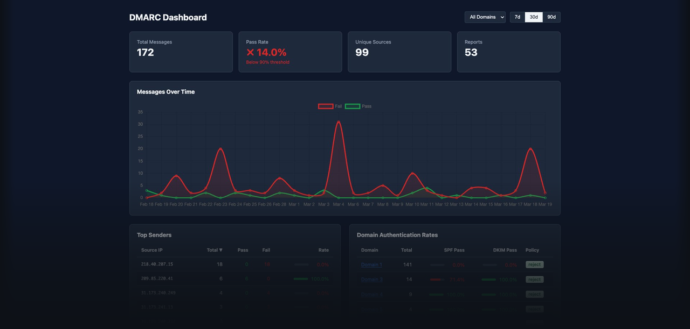

# DMARC Dashboard Kit

This project is born out of the frustration against expensive DMARC analytics services that individuals can't afford.

A self-hosted DMARC report analyzer on Cloudflare's free tier. One deploy script sets up everything: email ingestion, database, dashboard, and access control.

```
Email Sender → Cloudflare Email Routing → Worker email() → D1 (SQLite)
                                          Worker fetch()  → Dashboard (Svelte)
                                          Cloudflare Access (login wall)
```

A single Cloudflare Worker handles both DMARC report ingestion (via email) and serves the dashboard + API. Cloudflare Access protects the entire application.

## Prerequisites

- [Node.js](https://nodejs.org/) (v18+)
- [pnpm](https://pnpm.io/)
- A Cloudflare account with a domain (free plan works)
- A [Cloudflare API token](https://dash.cloudflare.com/profile/api-tokens) with permissions:
  - Workers Scripts: Edit
  - D1: Edit
  - DNS: Edit
  - Email Routing Rules: Edit
  - Access: Apps and Policies: Edit

## Quick Start

```bash
git clone <this-repo>
cd dmarc-dashboard-kit
pnpm install
pnpm run deploy
```

On first run, `pnpm run deploy` creates a `.env` file for you to fill in:

```bash
CLOUDFLARE_API_TOKEN=        # Your API token
CLOUDFLARE_ACCOUNT_ID=       # Account ID (dashboard → Overview → right sidebar)
CLOUDFLARE_ZONE_ID=          # Zone ID (same location — domain auto-detected from zone)
DMARC_EMAIL=dmarc            # Local part (receives at dmarc@yourdomain.com)
REPORT_AUTHORIZED_DOMAINS=   # Optional: comma-separated domains, or leave empty for wildcard
ACCESS_ALLOWED_EMAILS=       # comma-separated, e.g. "you@gmail.com,coworker@outlook.com"
```

Then run `pnpm run deploy` again.

## What Deploy Automates

| Step | What |
|------|------|
| 0 | Auto-detects domain from zone ID |
| 1 | Creates D1 database (`dmarc-reports`) |
| 2 | Generates `wrangler.toml` with D1 database ID |
| 3 | Runs D1 schema migrations (all `migrations/*.sql` in order) |
| 4 | Builds Svelte dashboard |
| 5 | Deploys worker (API + dashboard + email handler) |
| 6 | Creates email routing rule + `_report._dmarc` DNS TXT records |
| 7 | Creates Cloudflare Access application + policy |

## Manual Prerequisites (One-Time)

1. **Enable Email Routing** for your domain:
   > Cloudflare Dashboard → your domain → Email → Email Routing → Enable

2. **Enable Cloudflare Access** on your account:
   > Cloudflare Dashboard → Access → Get started

Both are one-time settings that cannot be automated via the API.

## Multi-Domain Support

To monitor a domain, two DNS records are needed:

**1. On the monitored domain** (the domain owner does this):
```
_dmarc.otherdomain.com  TXT  "v=DMARC1; p=none; rua=mailto:dmarc@yourdomain.com"
```

**2. On your receiving domain** (authorizes accepting reports):
```
otherdomain.com._report._dmarc.yourdomain.com  TXT  "v=DMARC1;"
```

The deploy script handles step 2 automatically:
- Set `REPORT_AUTHORIZED_DOMAINS=otherdomain.com,another.org` in `.env` for specific domains
- Or leave it empty to create a wildcard `*._report._dmarc` that accepts reports from any domain

> **Warning:** `p=none` only monitors — it does **not** block spoofed emails. Once you've reviewed your DMARC reports and confirmed all legitimate senders pass DKIM/SPF, move to `p=quarantine` and then `p=reject` as soon as possible.

## Local Development

```bash
# Run D1 migrations locally
pnpm run migrate:local

# Start worker dev server (API + email handler)
pnpm run dev

# In another terminal — start dashboard dev server
cd dashboard
pnpm install
pnpm run dev
```

The dashboard dev server (Vite) runs separately during development. In production, the built dashboard is served as static assets by the worker.

## Project Structure

```
├── src/                    # Cloudflare Worker
│   ├── index.ts            # Entry: email() + fetch() handlers
│   ├── email-handler.ts    # Email → parse XML → D1
│   ├── api.ts              # /api/* routes
│   ├── db.ts               # D1 queries
│   └── types.ts            # TypeScript types + DMARC enums
├── dashboard/              # Svelte SPA
│   └── src/
│       ├── App.svelte
│       ├── components/     # SummaryCards, Charts, Tables
│       └── lib/api.ts      # API client
├── migrations/
│   ├── 0001_init.sql       # D1 schema (reports + record_rows tables)
│   └── 0002_record_rows_unique.sql  # unique index on record_rows
├── deploy.sh               # One-command deploy
└── wrangler.toml           # Generated by deploy.sh (gitignored)
```

## License

MIT — see [LICENSE](LICENSE). Portions adapted from Cloudflare's [dmarc-email-worker](https://github.com/cloudflare/dmarc-email-worker).
